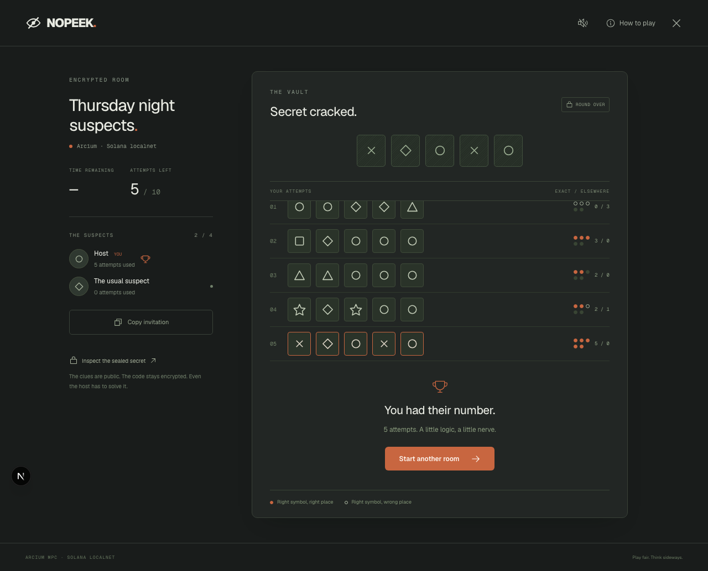

# NOPEEK

**One secret. Nobody gets to peek.**

[Play NOPEEK](https://nopeek-whu.vercel.app) · [Pitch](https://nopeek-whu.vercel.app/pitch) · [Deck PDF](https://nopeek-whu.vercel.app/nopeek-pitch.pdf) · [Editable deck](https://nopeek-whu.vercel.app/nopeek-pitch.pptx)

A multiplayer browser codebreaking game built for WHU 2026 / Superteam Germany. Up to four friends race to crack one five-symbol code with ten attempts each. The host has to solve it too.



## Why Solana and Arcium?

A conventional game server knows the answer. In an encrypted NOPEEK room, Arcium generates the code inside MPC and returns **MXE-owned ciphertext**. Neither the browser nor our web server receives a decryption key. Each guess is checked inside MPC; only two counts are revealed: correct positions and correct symbols elsewhere.

The Solana program stores the encrypted room, locks the player roster, enforces attempt limits and accepts verified Arcium callbacks that determine the winner. Solana is part of the referee rather than an added payment feature. Browser-generated player keys sign game actions and the server sponsors test-network fees, so players need no wallet extension or tokens.

This architecture removes the application's readable copy of the solution under the published program and the stated MPC assumptions. It does not claim Solana is the only possible platform for confidential computation.

## Current verification

The actual Anchor program and both compiled Arcis circuits have passed integration tests on a local Solana validator with two Arcium nodes. The test generates an encrypted code, solves it using only public feedback, verifies the winner, and checks host authorization, locked rosters, nonplayer rejection and input validation. A separate browser test completes the real multiplayer flow in two browser contexts.

Transaction evidence: [docs/chain-verification.json](docs/chain-verification.json). This file records its network explicitly; localnet signatures must not be presented as public devnet transactions. Public deployment readiness is exposed at `/api/health`.

[Watch the real encrypted multiplayer recording](https://nopeek-whu.vercel.app/pitch). The recording is labeled localnet and uses the actual Solana program and Arcium nodes.

Solo practice runs entirely in the browser and clearly discloses that its secret is stored locally. It is not a substitute for an MPC demonstration.

## Run the web app

Requires Node.js 22+ and npm.

```bash
npm ci
npm run dev
```

Open `http://localhost:3033`. Practice, the field guide and the web pitch work without keys or an RPC account. Encrypted multiplayer requires a running deployment and server-only configuration copied from `.env.example` to `.env.local`.

```bash
npm run typecheck
npm test
npm run test:e2e
npm run build
```

The optional GitHub Actions workflow is saved as `docs/github-actions.example.yml`; publishing it into `.github/workflows` requires a GitHub credential with workflow permission. All listed checks can run locally.

Install the test browser once with `npx playwright install chromium`. The ordinary browser suite covers desktop and mobile play, persistence, win/replay, privacy disclosure, invalid invitations and overflow checks. The multiplayer test is opt-in because it sends actual test-network transactions:

```bash
RUN_CHAIN_E2E=1 npx playwright test tests/browser/multiplayer.spec.ts --project desktop --workers 1
```

## Reproduce the MPC deployment locally

Install Rust 1.89.0, Anchor 1.0.2, Solana/Agave CLI, Docker with Compose, and Arcium CLI **0.13.2**. Start Docker. Refer to [Arcium's official tooling](https://docs.arcium.com/developers) for installation; the CLI, crate and TS SDK versions should match.

Generate separate test keys. Never use a wallet with real funds.

```bash
mkdir -p .keys chain/target/deploy
solana-keygen new --no-bip39-passphrase -o .keys/sponsor.json
solana-keygen new --no-bip39-passphrase -o chain/target/deploy/nopeek-keypair.json
cd chain
arcium keys sync
arcium build
cp target/idl/nopeek.json ../src/lib/idl.json
arcium test --skip-build --detach
```

`keys sync` updates the program ID for your own generated deployment key; commit that update only for your deployment. The test waits for MXE keys, initializes the two computation definitions and executes the real game flow. Localnet uses unlimited test SOL; no external faucet is needed.

Point `.env.local` at the generated program ID, `http://127.0.0.1:8899`, cluster offset `0` and an absolute `SOLANA_KEYPAIR_PATH` to your test sponsor. Restart the web server. To stop only NOPEEK's detached containers, run the `docker compose ... down` command printed by Arcium; do not stop unrelated Docker workloads.

## Deploy to Solana devnet

Fund the separate sponsor using a free test-SOL faucet. The public RPC endpoint is supported. Do not buy or use mainnet SOL. Initial deployment needs enough test SOL for the program, MXE accounts, circuit storage and later sponsored actions.

```bash
cd chain
arcium deploy --cluster-offset 456 --recovery-set-size 4 \
  --keypair-path ../.keys/sponsor.json \
  --program-keypair target/deploy/nopeek-keypair.json \
  --program-name nopeek --rpc-url https://api.devnet.solana.com
cd ..
SOLANA_RPC_URL=https://api.devnet.solana.com ARCIUM_CLUSTER_OFFSET=456 npm run chain:init
```

Verify cluster availability and version compatibility against the current Arcium developer docs before a fresh deployment. A partially interrupted deploy can be resumed with the CLI's `--resume` option. Circuit initialization is idempotent.

For hosting, set `SOLANA_RPC_URL`, `NOPEEK_PROGRAM_ID`, `ARCIUM_CLUSTER_OFFSET` and `SOLANA_SPONSOR_SECRET` as **server-only** environment variables. The last value is the sponsor's JSON secret-key array and must never be committed or placed in a `NEXT_PUBLIC_` variable. Mutation endpoints check the devnet genesis hash before sponsorship; localhost is allowed for local development.

## Rules and security assumptions

- Five positions, six symbols, duplicates allowed; frequency scoring never double-counts a symbol.
- Four player keys maximum. Membership locks when the host starts the 20-minute race.
- Ten attempts per player, one pending computation per player. A stalled attempt can be canceled after three minutes; it remains consumed and a late callback cannot turn it into a winner.
- The first correct callback executed on Solana wins. Network callback order can differ from browser submission order. A pre-deadline guess may finish processing after the deadline.
- Guesses and feedback are public. Players can learn from each other; the answer may be inferred from clues. Ten guesses are a deduction rule, not an information-theoretic secrecy guarantee.
- Arcium confidentiality depends on its cluster security assumptions, including at least one honest MPC node. Local nodes controlled by one developer demonstrate functionality, not independent-party deployment trust.
- The hackathon devnet program may retain its upgrade authority. Retention is a trust assumption: the operator can replace the rules. Inspect the program account, the source and the field guide. No audited or immutable-production claim is made.
- Browser keys represent game identities, not verified humans. Clearing browser storage loses that identity; separate browsers are separate players. Players can collude.
- A sponsor signature covers the whole transaction. The relay requires valid signatures, the sponsor as fee payer and only NOPEEK/compute-budget instructions. It never receives a player's private key. These controls do not make the sponsor immune to spam: in-memory IP limits are best-effort and should become durable limits before public scale.
- Public RPC availability, Arcium latency and sponsor funds affect play. This is a test-network prototype with no wager, financial prize or player payment in the game.

## Project map

| Location                            | Responsibility                                            |
| ----------------------------------- | --------------------------------------------------------- |
| `chain/encrypted-ixs/src/lib.rs`    | MPC secret generation and duplicate-safe scoring          |
| `chain/programs/nopeek/src/lib.rs`  | Room rules, authorization and verified callbacks          |
| `src/lib/server-chain.ts`           | Sponsored transaction preparation and public room reading |
| `src/lib/client-chain.ts`           | Browser identities and player signatures                  |
| `src/components/game-room.tsx`      | Practice and encrypted-room UX                            |
| `scripts/test-chain.ts`             | Real Solana/Arcium integration evidence                   |
| `tests/browser/multiplayer.spec.ts` | Real two-player browser flow                              |
| `public/nopeek-pitch.pdf` / `.pptx` | Submission deck                                           |
| `docs/submission.md`                | Submission text and presenter script                      |

## First users and next steps

First users are WHU participants, student groups and friends who already play browser party games. Each room invitation can bring three other players. Validate whether they understand clues, complete rounds and ask to play again before making retention or market-size claims. Themed room packs and event hosting are business hypotheses; compute costs and willingness to pay still need measurement.

Next work after the hackathon: external review of callback/state-machine security, explicit upgrade-authority policy, durable sponsorship quotas, measured compute latency/costs and identity recovery.

## Credits

Arcium account macros and integration patterns are adapted from the official [Arcium examples](https://github.com/arcium-hq/examples), especially coinflip. NOPEEK's game circuits, room state machine, browser interface, tests and presentation were developed for this project with Codex. Icons are from Phosphor; typography is Geist. See [Solana's developer docs](https://solana.com/docs) and [Arcium's documentation](https://docs.arcium.com/developers) for the underlying platforms.
